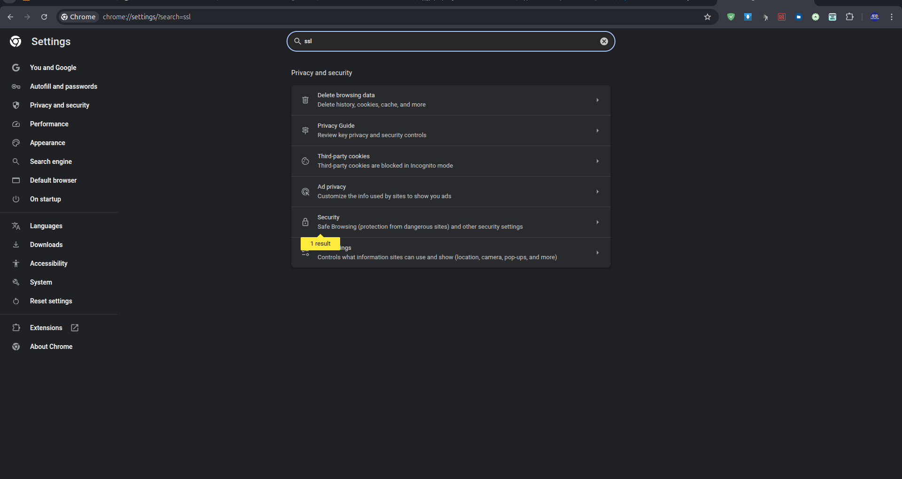

# ssl-lokal-nginx

### Create SSL

```
openssl req -x509 -nodes -days 365 -newkey rsa:2048 \
-keyout /etc/ssl/private/domain.key \
-out /etc/ssl/certs/domain.crt \
-subj "/C=ID/ST=Local/L=Local/O=DomainOrg/CN=domain" \
-addext "subjectAltName=DNS:domain,IP:ipDomain"

```

##### Domain & ipDomain bisa kamu ganti sesuai kebutuhan, contoh :

```
-addext "subjectAltName=DNS:localhost,IP:127.0.0.1"
```

##### Atau kamu sudah membuat domain dengan Bind9 pada lokal server?

```
-addext "subjectAltName=DNS:domain.lokal,DNS:*.domain.lokal,IP:192.168.17.248"
```

##### Apabila terdapat banyak IP yang digunakan pada domain kamu, kamu tinggal menambahkan koma setelah IP pertama ditambahkan.

```
-addext "subjectAltName=DNS:domain.lokal,DNS:*.domain.lokal,IP:192.168.17.248,IP:172.27.170.106"
```

---

### Install Domain pada Server & Client

```
sudo cp /etc/ssl/certs/domain.lokal.crt /usr/local/share/ca-certificates/domain.lokal.crt
sudo update-ca-certificates

```

###### Perintah diatas juga bisa kamu aplikasikan pada sisi client, namun umumnya pada client cuma install melalui aplikasi browser yang digunakan (tidak menginstalnya langsung pada sistem)

---

### Konfigurasi Nginx

```
server {
    listen 80;
    listen [::]:80;
    server_name domain.lokal;
    root /var/www/html;
    index index.php index.html index.nginx-debian.html index.htm;

    # Redirect HTTP ke HTTPS
    return 301 https://$host$request_uri;
}

server {
    listen 443 ssl;
    listen [::]:443 ssl;
    server_name domain.lokal;
    root /var/www/html;
    index index.php index.html index.nginx-debian.html index.htm;

    # Lokasi sertifikat SSL dan private key
    ssl_certificate /etc/ssl/certs/domain.lokal.crt;
    ssl_certificate_key /etc/ssl/private/domain.lokal.key;

    # SSL Settings (Optional, untuk keamanan lebih baik)
    ssl_protocols TLSv1.2 TLSv1.3;
    ssl_ciphers 'TLS_AES_128_GCM_SHA256:TLS_AES_256_GCM_SHA384:ECDHE-RSA-AES128-GCM-SHA256:ECDHE-RSA-AES256-GCM-SHA384';
    ssl_prefer_server_ciphers on;

    # HTTP Strict Transport Security (HSTS)
    add_header Strict-Transport-Security "max-age=31536000; includeSubDomains" always;

    location / {
        try_files $uri $uri/ /index.php$is_args$args;
    }

    location ~ \.php$ {
        include snippets/fastcgi-php.conf;
        fastcgi_pass 127.0.0.1:9000; # Port yang digunakan oleh PHP-FPM defaultnya pakai sock "fastcgi_pass unix:/run/php/php7.4-fpm.sock;" 7.4 adalah versi php yang terinstall.
        fastcgi_param SCRIPT_FILENAME $document_root$fastcgi_script_name;
        fastcgi_buffers 16 16k;
        fastcgi_buffer_size 32k;
        include fastcgi_params;
    }

    location ~ /\.ht {
        deny all;
    }
    error_log /var/log/nginx/domain.lokal_error.log;
    access_log /var/log/nginx/domain.lokal_access.log;
}
```

---

### Install SSL di Chrome




---

### Pembuktian


